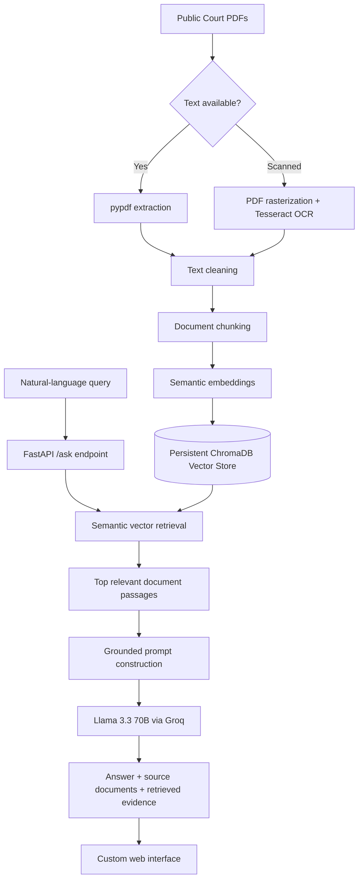

# THE ARCHIVE — Grounded Court-Document Intelligence

> A full-stack Retrieval-Augmented Generation (RAG) system that transforms public federal court records into a searchable semantic knowledge base and answers natural-language questions using retrieved evidence rather than unconstrained model memory.

**Live application:** https://the-archive-seven.vercel.app

## Product Interface

<p align="center">
  
</p>

The deployed frontend uses a custom investigative-record aesthetic rather than a stock chat interface. It is intentionally single-purpose: users submit a research question, the backend retrieves semantically relevant passages, and the generation layer is constrained to those retrieved records.

> **Deployment note:** the public site currently showcases the application interface and architecture, but the complete document corpus and persistent vector index are not bundled with the hosted deployment because of storage/compute constraints. The repository contains the ingestion, OCR, cleaning, chunking, indexing, retrieval, API, and grounded-generation code needed to rebuild the knowledge base locally.

## Why This Project Exists

Large legal-document collections are difficult to investigate manually: records span many pages, terminology varies, scanned PDFs require OCR, and ordinary keyword search misses semantically related passages.

**The Archive** builds an end-to-end document-intelligence pipeline around that problem. It ingests court PDFs, extracts and cleans their text, divides the corpus into retrieval-sized passages, embeds those passages into a persistent vector database, retrieves evidence semantically, and supplies only the retrieved context to an LLM for a grounded answer.

The result is closer to an **evidence-backed research interface** than a generic chatbot: retrieval happens before generation, answers are constrained to the indexed corpus, and source documents are returned with each response.

## System Architecture



## Intelligence Pipeline

### 1. Hybrid PDF Ingestion

`backend/ingest.py`

The ingestion layer supports both text-native and scanned records:

- attempts direct extraction with `pypdf` first;
- detects insufficient extracted text;
- falls back to page rasterization with `pdf2image`;
- performs OCR with Tesseract;
- preserves page boundaries in the extracted representation;
- uses project-relative paths and an optional `POPPLER_PATH` environment variable.

### 2. Corpus Cleaning & Chunking

`backend/clean_text.py` → `backend/chunk.py`

Raw extraction output is normalized before being divided into smaller passages suitable for semantic retrieval. Chunk-level files provide a transparent intermediate representation between source documents and the vector index.

### 3. Persistent Semantic Index

`backend/embed.py`

Processed chunks are embedded into a persistent **ChromaDB** collection configured for cosine-space retrieval. Each vector entry retains source-document metadata, allowing retrieval results to remain traceable to the underlying record.

The embedding stage is incremental: existing chunk IDs are detected and skipped instead of being blindly re-indexed.

### 4. Evidence Retrieval

`backend/query.py`

A query is sent through the same ChromaDB collection used by the application. The system retrieves the highest-ranking passages together with source metadata and vector-distance information.

This separates **retrieval** from **generation**: the language model does not decide which documents are relevant by itself.

### 5. Grounded Generation API

`backend/main.py`

The FastAPI service exposes a `/ask` endpoint that:

1. validates the incoming question;
2. retrieves the top matching passages from ChromaDB;
3. constructs a context window from those passages;
4. instructs the model to use only that evidence and avoid speculation;
5. generates the response using **Llama 3.3 70B through Groq**;
6. returns the answer, unique source-document names, and the retrieved passages.

Generation uses a low temperature (`0.1`) to favor consistent, evidence-oriented responses.

## What Makes It More Than a Chatbot

| Capability | Implementation |
|---|---|
| Semantic search | Vector retrieval instead of literal keyword matching |
| Scanned-document support | OCR fallback for image-only PDFs |
| Persistent knowledge base | ChromaDB vector storage |
| Grounded generation | LLM receives retrieved court excerpts as context |
| Source traceability | Source metadata returned with answers |
| Retrieval transparency | API also returns passages used for generation |
| Corpus isolation | Prompt explicitly prohibits outside information |
| Full-stack delivery | FastAPI backend + custom deployed web interface |

## Technology Stack

| Layer | Technology |
|---|---|
| API | FastAPI, Pydantic, Uvicorn |
| Vector database | ChromaDB |
| Retrieval | Semantic vector similarity / cosine space |
| Generation | Llama 3.3 70B via Groq API |
| PDF extraction | pypdf |
| OCR fallback | Tesseract OCR + pdf2image |
| Frontend | HTML, CSS, JavaScript |
| Deployment | Vercel frontend + Render-compatible backend configuration |
| Configuration | python-dotenv / environment variables |

## Repository Structure

```text
the-archive/
├── backend/
│   ├── main.py
│   ├── ingest.py
│   ├── clean_text.py
│   ├── chunk.py
│   ├── embed.py
│   ├── query.py
│   ├── database.py
│   ├── requirements.txt
│   └── render.yaml
├── data/
│   ├── raw/
│   ├── processed/
│   └── chunked/
├── docs/
│   └── screenshots/
├── frontend/
│   ├── index.html
│   └── bg.mp4
├── .gitignore
└── README.md
```

Generated local artifacts such as `.env`, virtual environments, ChromaDB storage, raw PDFs, processed text, and chunk outputs are ignored for future commits.

## API Contract

### `GET /`

Returns service health information and the number of indexed records in the active ChromaDB collection.

### `POST /ask`

Request:

```json
{
  "question": "What does the record state about ...?"
}
```

Response shape:

```json
{
  "answer": "Grounded answer generated from retrieved passages",
  "sources": ["source-document.pdf"],
  "retrieved_chunks": ["supporting passage ..."]
}
```

## Local Setup

```bash
git clone https://github.com/yyashikasharmaa/the-archive.git
cd the-archive/backend

python -m venv .venv
source .venv/bin/activate       # Linux/macOS
# .venv\Scripts\activate      # Windows

pip install -r requirements.txt
```

Create `backend/.env`:

```env
GROQ_API_KEY=your_key_here
# Optional on Windows when Poppler is not on PATH:
# POPPLER_PATH=C:\path\to\poppler\Library\bin
```

Tesseract and Poppler must also be available on the host for scanned-PDF OCR.

To rebuild the corpus:

```bash
python ingest.py
python clean_text.py
python chunk.py
python embed.py
```

Start the API:

```bash
uvicorn main:app --reload
```

## Engineering Decisions

**Retrieval before generation.** The system searches the corpus first and gives the model only a small set of relevant passages. This reduces dependence on model memory and makes answers auditable against retrieved evidence.

**Direct extraction before OCR.** OCR is computationally expensive and can introduce recognition errors. Text-native PDFs therefore use direct parsing first, while OCR is reserved for documents that require it.

**Persistent vector storage.** Embeddings are generated during corpus preparation rather than recomputed for every user query, keeping online retrieval lightweight.

**Low-temperature generation.** The application is intended for document research, not creative writing. A low generation temperature is used to prioritize precision and consistency.

**Source metadata at chunk level.** Every indexed passage carries its originating filename so the API can reconstruct source attribution after semantic retrieval.

## Current Deployment Constraint

The hosted version does **not** ship with the complete retrieval corpus/vector index. That choice reflects the storage and compute limits of the deployment environment used for the project.

This means the public website should be treated as a live product-interface deployment rather than a continuously available production legal-search service. The RAG pipeline itself remains reproducible from the repository when the document corpus is supplied locally and the vector store is rebuilt.

## Limitations & Next Steps

The current implementation is a focused portfolio-scale RAG system rather than a production legal-research platform. Natural extensions include reranking, page-level citations, hybrid BM25 + vector retrieval, automated RAG evaluation, streaming responses, authentication/rate limiting, richer corpus metadata, and a deployment architecture capable of persisting the full index.

## Data & Responsible Use

The project is designed around publicly released federal court records and is intended as a document-retrieval/research demonstration. Generated responses should be treated as navigation aids to the underlying records, not as independent factual or legal conclusions. Important claims should be verified against the source material.

## Author

**Yashika Sharma**  
Computer Science — Data Science  
AI systems · RAG · robotics · product-oriented engineering
